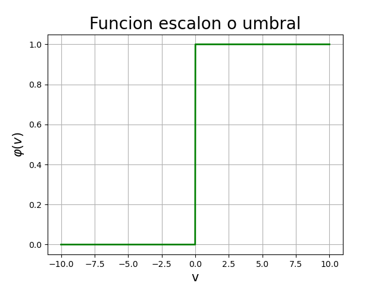
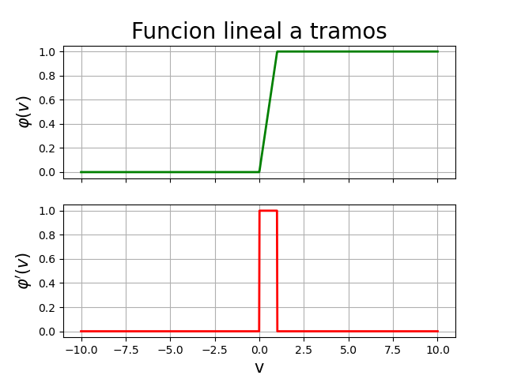
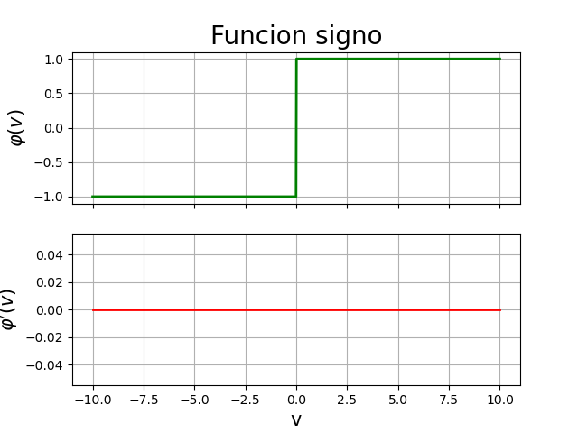
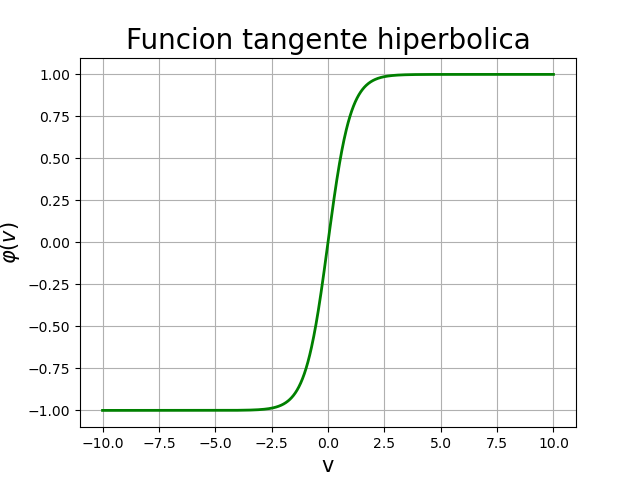
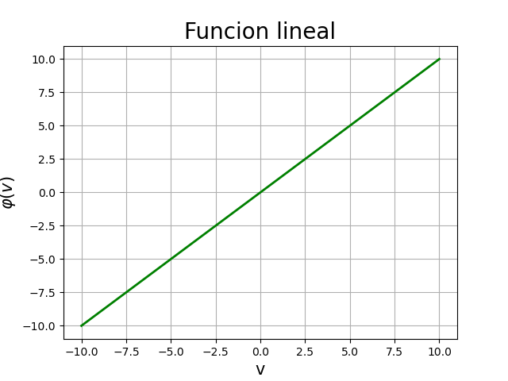
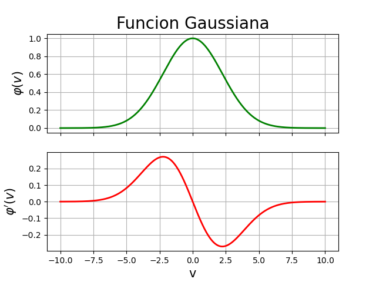
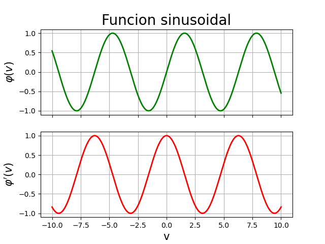
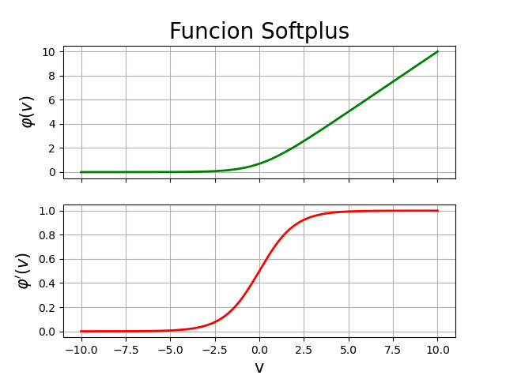
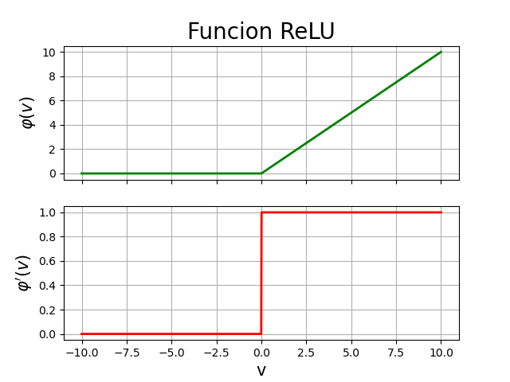

# Redes Neuronales

## Funciones de activación y su derivada

### Función ***Escalón***

$$
\large
y = \varphi(v) =
\left\lbrace
\begin{matrix}
    1 & \text{si } v \geq 0 \\
    0 & \text{si } v < 0
\end{matrix}
\right.
\quad\quad
\varphi(v) \in \lbrace 0, 1 \rbrace
\quad\quad
\nexists \frac{d}{dv} y
$$

No muy utilizada actualmente.

### Función ***Lineal a Tramos***

$$
\large
y = \varphi(v) =
\left\lbrace
\begin{matrix}
    1 & v \geq 1 \\
    v & 0 < v < 1 \\
    0 & v \leq 0
\end{matrix}
\right.
$$

### Función ***Logística***

$$
\large
y = \varphi(v) = \dfrac{1}{1 + e^{-av}}
\quad\quad
\varphi(v) \in \big( 0, 1 \big)
\quad\quad
\frac{d}{dv}y = ay(1 - y)
$$

$$
\varphi(v) = \frac{1}{1+e^{-av}} = \left( 1 + e^{-av} \right)^{-1}
$$

$$
\varphi'(v) = (-1)(1+e^{-av})^{-2}(e^{-av})(-a) = \frac{ae^{-av}}{(1+e^{-av})^2}
$$

$$
\varphi'(v) = \left( \frac{a}{1+e^{-av}} \right) \left( \frac{e^{-av}}{1+e^{-av}} \right)
= \left( \frac{a}{1+e^{-av}} \right) \left( \frac{1+e^{-av}-1}{1+e^{-av}} \right)
$$

$$
\varphi'(v) = \left( \frac{a}{1+e^{-av}} \right)
\left( \cancel{\frac{1+e^{-av}}{1+e^{-av}}} - \frac{1}{1+e^{-av}} \right)
$$

$$
\varphi'(v) = a\left( \frac{1}{1+e^{-av}} \right) \left( 1 - \frac{1}{1+e^{-av}} \right)
= a\varphi(v) \left[ 1 - \varphi(v) \right]
$$

Se utiliza en cualquier capa pero sobretodo en la capa de salida para clasificación.

### Función ***Signo***

$$
\large
\varphi(v) =
\left\lbrace
\begin{matrix}
    1 & \text{si } v > 0 \\
    0 & \text{si } v = 0 \\
    -1 & \text{si } v < 0
\end{matrix}
\right.
$$

No muy utilizada actualmente.

### Función ***Tangente Hiperbólica***

$$
\large
y = \varphi(v) = a\tanh(bv)
\quad\quad
\varphi(v) \in \big( -1, 1 \big)
\quad\quad
\frac{d}{dv}y = \frac{b}{a}(a-y)(a+y)
$$

$$
\varphi'(v) = ab\text{ sech}^2(bv) = ab(1-\tanh^2(bv)) = ab - ab\tanh^2(bv)
$$

$$
\varphi'(v) = \left( \frac{a}{a} \right) (ab-ab\tanh^2(bv))
= \frac{a^2b - a^2b\tanh^2(bv)}{a}
$$

$$
\varphi'(v) = \frac{b(a^2 - a^2\tanh^2(bv))}{a}
= \left( \frac{b}{a} \right) (a^2 - a^2\tanh^2(bv))
$$

$$
\varphi'(v) = \left( \frac{b}{a} \right) (a - a\tanh(bv)) (a+a\tanh(bv))
= \left( \frac{b}{a} \right) (a-y) (a+y)
$$

Se utiliza solo en capas ocultas.

### Función ***Lineal*** o ***Identidad***

$$
\large
y = \varphi(v) = Av
\quad\quad
\varphi(v) \in (-\infty, \infty)
\quad\quad
\frac{d}{dv}y = \frac{d}{dv}\varphi(v) = A
$$

Se utiliza en la última capa para casos de regresión.

### Función ***Gaussiana***

$$
\large
y = \varphi(v) = Ae^{-Bv^2}
\quad\quad
\varphi(v) \in ( 0, 1 ]
\quad\quad
\frac{d}{dv}y = -2Bvy
$$

$$
\large
\varphi'(v) = -2Bv Ae^{-Bv^2}
$$

Se utiliza en arquitecturas específicas como en la ***RBF-NN***.

### Función ***Sinusoidal***

$$
\large
\varphi(v) = A\sin(Bv + C)
$$

$$
\large
\varphi'(v) = A\cos(Bv+C)
$$

### Función ***Softplus***

$$
\large
y = \varphi(v) = \ln(1+e^{av})
\quad\quad
\varphi(v) \in ( 0, \infty )
\quad\quad
\frac{d}{dv}y = \frac{1}{1+e^{-av}}
$$

$$
\varphi'(v) = \frac{ae^{av}}{1+e^{av}}
= a\left[ \frac{e^{av}}{1+e^{av}} \left( \frac{\frac{1}{e^{av}}}{\frac{1}{e^{av}}} \right) \right]
= a\left( \frac{1}{1+e^{-av}} \right)
$$

$$
\varphi'(v) = \frac{a}{1+e^{-av}}
$$

Se utiliza solo en capas ocultas y especialmente en redes profundas.

### Función ***ReLU (Rectified Linear Unit)***

$$
\large
y = \varphi(v) = \max(0, v)
\quad\quad
\varphi(v) \in [0, \infty)
\quad\quad
\frac{d}{dv}y =\left\lbrace
\begin{matrix}
	1 & \text{si } v \geq 0 \\
	0 & \text{si } v < 0
\end{matrix}
\right.
$$

Se utiliza solo en capas ocultas y especialmente en redes profundas.

### Función ***Leaky ReLU***

$$
\large
y = \varphi(v) = \left\lbrace
\begin{matrix}
	0.1v & \text{si } v < 0 \\
	v & \text{si } v \geq 0
\end{matrix}
\right.
\quad\quad
\varphi(v) \in (-\infty,\infty)
\quad\quad
\frac{d}{dv}y = \left\lbrace
\begin{matrix}
	0.1 & \text{si } v < 0 \\
	1 & \text{si } v \geq 0
\end{matrix}
\right.
$$

Se utiliza solo en capas ocultas y especialmente en redes profundas. Corrige
algunos detalles de la ***ReLU***.
