# Redes Neuronales

## Funciones de activación y su derivada

### Función ***Escalón***

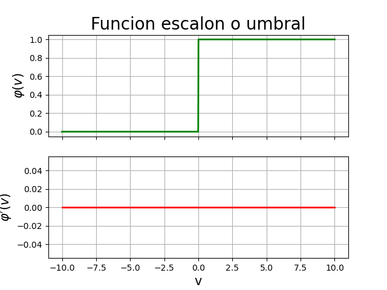

$$
\large
y = \varphi(v) =
\left\lbrace
\begin{matrix}
    1 & \text{si } v \geq 0 \\
    0 & \text{si } v < 0
\end{matrix}
\right.
\quad\quad
\varphi(v) \in \lbrace 0, 1 \rbrace
\quad\quad
\nexists \frac{d}{dv} y
$$

No muy utilizada actualmente.

### Función ***Lineal a Tramos***

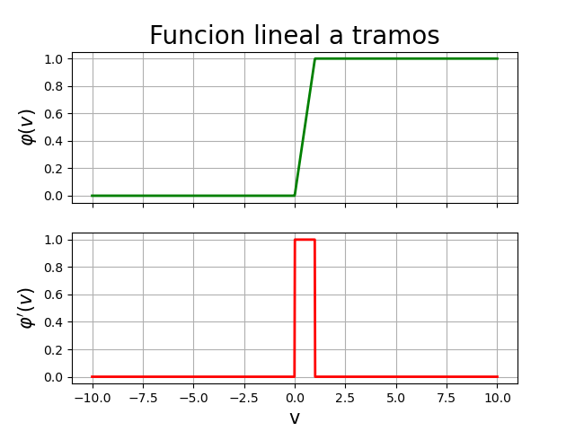

$$
\large
y = \varphi(v) =
\left\lbrace
\begin{matrix}
    1 & v \geq 1 \\
    v & 0 < v < 1 \\
    0 & v \leq 0
\end{matrix}
\right.
$$

### Función ***Logística***

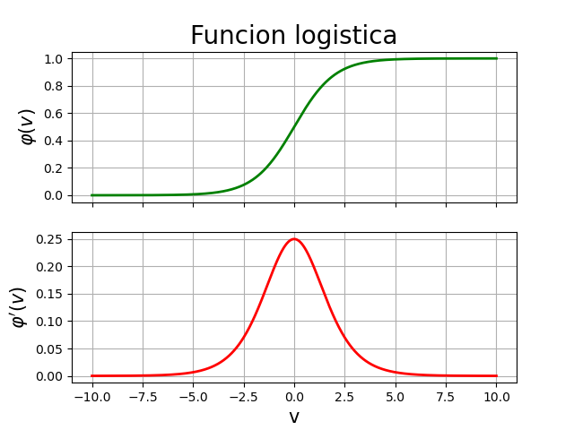

$$
\large
y = \varphi(v) = \dfrac{1}{1 + e^{-av}}
\quad\quad
\varphi(v) \in \big( 0, 1 \big)
\quad\quad
\frac{d}{dv}y = ay(1 - y)
$$

$$
\varphi(v) = \frac{1}{1+e^{-av}} = \left( 1 + e^{-av} \right)^{-1}
$$

$$
\varphi'(v) = (-1)(1+e^{-av})^{-2}(e^{-av})(-a) = \frac{ae^{-av}}{(1+e^{-av})^2}
$$

$$
\varphi'(v) = \left( \frac{a}{1+e^{-av}} \right) \left( \frac{e^{-av}}{1+e^{-av}} \right)
= \left( \frac{a}{1+e^{-av}} \right) \left( \frac{1+e^{-av}-1}{1+e^{-av}} \right)
$$

$$
\varphi'(v) = \left( \frac{a}{1+e^{-av}} \right)
\left( \cancel{\frac{1+e^{-av}}{1+e^{-av}}} - \frac{1}{1+e^{-av}} \right)
$$

$$
\varphi'(v) = a\left( \frac{1}{1+e^{-av}} \right) \left( 1 - \frac{1}{1+e^{-av}} \right)
= a\varphi(v) \left[ 1 - \varphi(v) \right]
$$

Se utiliza en cualquier capa pero sobretodo en la capa de salida para clasificación.

### Función ***Signo***

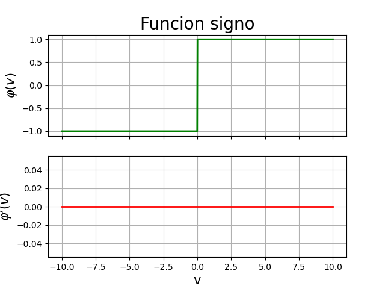

$$
\large
\varphi(v) =
\left\lbrace
\begin{matrix}
    1 & \text{si } v > 0 \\
    0 & \text{si } v = 0 \\
    -1 & \text{si } v < 0
\end{matrix}
\right.
$$

No muy utilizada actualmente.

### Función ***Tangente Hiperbólica***

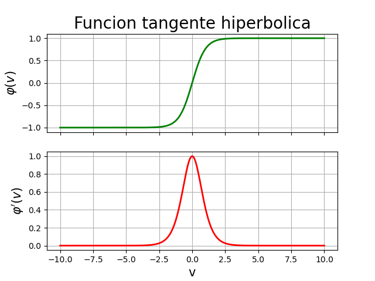

$$
\large
y = \varphi(v) = a\tanh(bv)
\quad\quad
\varphi(v) \in \big( -1, 1 \big)
\quad\quad
\frac{d}{dv}y = \frac{b}{a}(a-y)(a+y)
$$

$$
\varphi'(v) = ab\text{ sech}^2(bv) = ab(1-\tanh^2(bv)) = ab - ab\tanh^2(bv)
$$

$$
\varphi'(v) = \left( \frac{a}{a} \right) (ab-ab\tanh^2(bv))
= \frac{a^2b - a^2b\tanh^2(bv)}{a}
$$

$$
\varphi'(v) = \frac{b(a^2 - a^2\tanh^2(bv))}{a}
= \left( \frac{b}{a} \right) (a^2 - a^2\tanh^2(bv))
$$

$$
\varphi'(v) = \left( \frac{b}{a} \right) (a - a\tanh(bv)) (a+a\tanh(bv))
= \left( \frac{b}{a} \right) (a-y) (a+y)
$$

Se utiliza solo en capas ocultas.

### Función ***Lineal*** o ***Identidad***

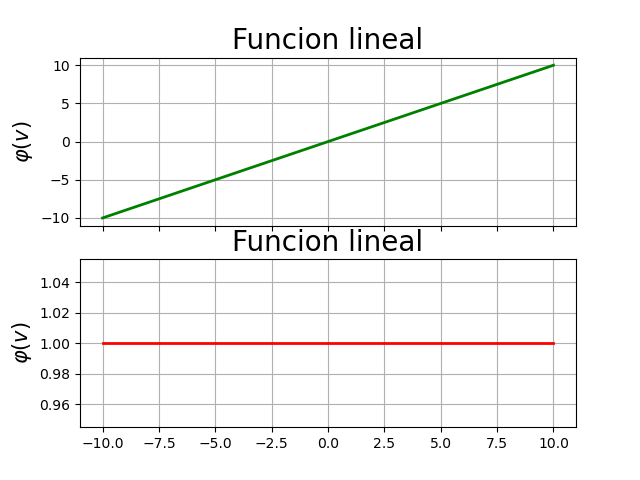

$$
\large
y = \varphi(v) = Av
\quad\quad
\varphi(v) \in (-\infty, \infty)
\quad\quad
\frac{d}{dv}y = \frac{d}{dv}\varphi(v) = A
$$

Se utiliza en la última capa para casos de regresión.

### Función ***Gaussiana***

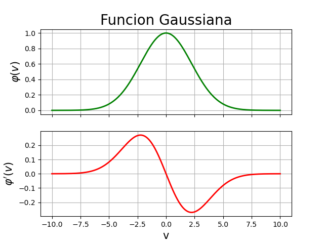

$$
\large
y = \varphi(v) = Ae^{-Bv^2}
\quad\quad
\varphi(v) \in ( 0, 1 ]
\quad\quad
\frac{d}{dv}y = -2Bvy
$$

$$
\large
\varphi'(v) = -2Bv Ae^{-Bv^2}
$$

Se utiliza en arquitecturas específicas como en la ***RBF-NN***.

### Función ***Sinusoidal***

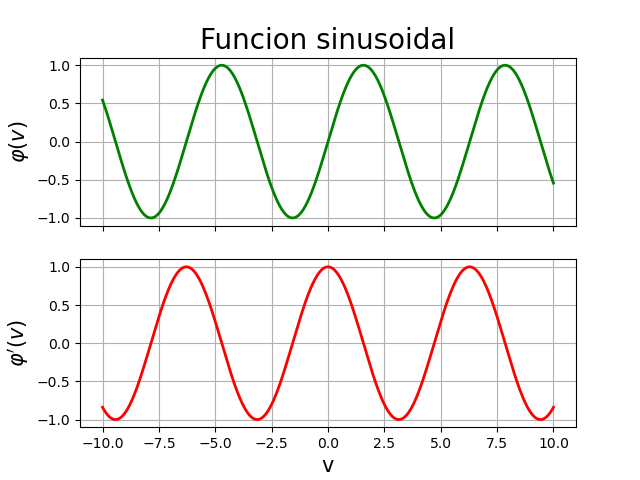

$$
\large
\varphi(v) = A\sin(Bv + C)
$$

$$
\large
\varphi'(v) = A\cos(Bv+C)
$$

### Función ***Softplus***

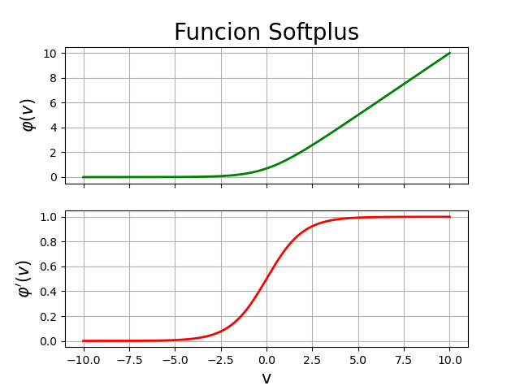

$$
\large
y = \varphi(v) = \ln(1+e^{av})
\quad\quad
\varphi(v) \in ( 0, \infty )
\quad\quad
\frac{d}{dv}y = \frac{1}{1+e^{-av}}
$$

$$
\varphi'(v) = \frac{ae^{av}}{1+e^{av}}
= a\left[ \frac{e^{av}}{1+e^{av}} \left( \frac{\frac{1}{e^{av}}}{\frac{1}{e^{av}}} \right) \right]
= a\left( \frac{1}{1+e^{-av}} \right)
$$

$$
\varphi'(v) = \frac{a}{1+e^{-av}}
$$

Se utiliza solo en capas ocultas y especialmente en redes profundas.

### Función ***ReLU (Rectified Linear Unit)***

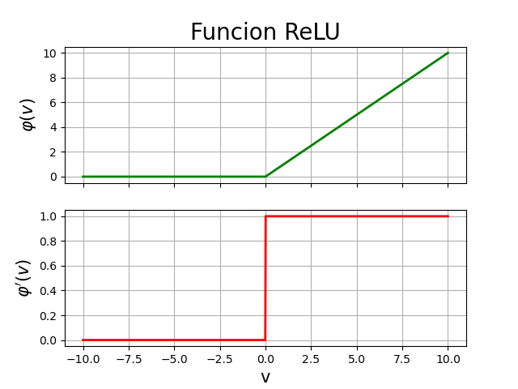

$$
\large
y = \varphi(v) = \max(0, v)
\quad\quad
\varphi(v) \in [0, \infty)
\quad\quad
\frac{d}{dv}y =\left\lbrace
\begin{matrix}
    1 & \text{si } v \geq 0 \\
    0 & \text{si } v < 0
\end{matrix}
\right.
$$

Se utiliza solo en capas ocultas y especialmente en redes profundas.

### Función ***Leaky ReLU***

$$
\large
y = \varphi(v) = \left\lbrace
\begin{matrix}
    0.1v & \text{si } v < 0 \\
    v & \text{si } v \geq 0
\end{matrix}
\right.
\quad\quad
\varphi(v) \in (-\infty,\infty)
\quad\quad
\frac{d}{dv}y = \left\lbrace
\begin{matrix}
    0.1 & \text{si } v < 0 \\
    1 & \text{si } v \geq 0
\end{matrix}
\right.
$$

Se utiliza solo en capas ocultas y especialmente en redes profundas. Corrige
algunos detalles de la ***ReLU***.

## La Neurona Artificial

La neurona artificial se representa de la siguiente manera


Con $n$ entradas $x$, $n$ pesos sinápticos representados con $w$ y un bias $b$,
la acumulación de todas estás señales representa un proceso sumatorio que da
como resultado el valor $v$ que se encuentra debajo.

$$
v = w_1x_1 + w_2x_2 + \cdots + w_nx_n + b
$$

$$
v = \sum_{i=1}^p \left[ w_i x_i \right] + b
$$

Representando las ecuaciones anteriores de forma vectorial se tiene lo
siguiente:

$$
x =
\begin{bmatrix}
    x_1 \\
    x_2 \\
    \vdots \\
    x_n
\end{bmatrix}
\quad\quad
w =
\begin{bmatrix}
    w_1 \\
    w_2 \\
    \vdots \\
    w_n
\end{bmatrix}
$$

$$
v = w^\top x + b
$$

Al final de la acumulatoria, se tiene un umbral o función de activación, con lo
que se condiciona la salida de la neurona.

$$
y = \varphi (v)
$$

## El Perceptrón

En el perceptrón, se tiene la misma estructura de la red neuronal.

$$
v = w_1x_1 + w_2x_2 + \cdots + w_nx_n + b
$$

$$
v = \sum_{i=1}^p \left[ w_ix_i \right] + b
$$

Con

$$
x =
\begin{bmatrix}
    x_1 \\
    x_2 \\
    \vdots \\
    x_n
\end{bmatrix}
\quad\quad\text{y}\quad\quad
w =
\begin{bmatrix}
    w_1 \\
    w_2 \\
    \vdots \\
    w_n
\end{bmatrix}
$$

$$
v = w^\top x + b
$$

En esta neurona se usa la función de activación de tipo escalón.

$$
y = \varphi (v) =
\left\lbrace
\begin{matrix}
    1 & \text{si } v \geq 0 \\
    0 & \text{si } v < 0
\end{matrix}
\right.
$$

### El Perceptrón en 2 dimensiones

Para clasificar y dibujar un hiperplano separador en un espacio de 2
dimensiones se tendría una representación del perceptrón como la siguiente.

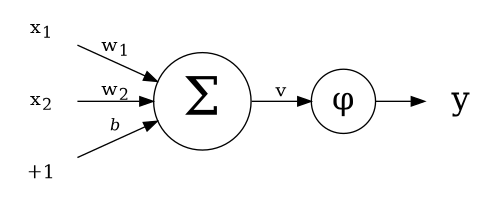

Así, se tendría el valor de $v$ como

$$
v = w_1x_1 + w_2x_2 + b
$$

Ya que la ecuación anterior se comporta como la ecuación de la recta

$$
0 = ax + by + c
$$

funciona para dibujar un hiperplano separador entre los patrones de entrada,
como en el ejemplo siguiente


para dibujar el hiperplano, se despeja $x_2$ de la ecuación

$$
v = w_1x_1 + w_2x_2 + b
$$

resultando en

$$
x_2 = -\dfrac{w_1}{w_2}x_1 - \dfrac{b}{w_2} 
$$

Con $x_1$ siendo una variable que depende del tiempo.
Observando la ecuación anterior, se parece mucho a la función

$$
y = mx + b
$$

Que es otra manera de representar una recta, con esto, se tiene el hiperplano
que muestra la forma en que el perceptrón clasificó los datos de entrada.

### El Perceptrón en 3 dimensiones

Para un caso de 3 dimensiones, se tiene la siguiente ecuación

$$
x_3 = -\dfrac{w_1x_1}{w_3} - \dfrac{w_2x_2}{w_3} - \dfrac{b}{w_3}
$$

Con la representación del perceptrón de la siguiente manera

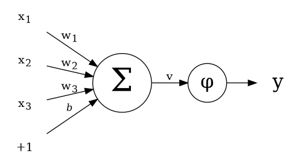

Un ejemplo de un perceptrón usado en un caso con datos de entrada de 3
dimensiones

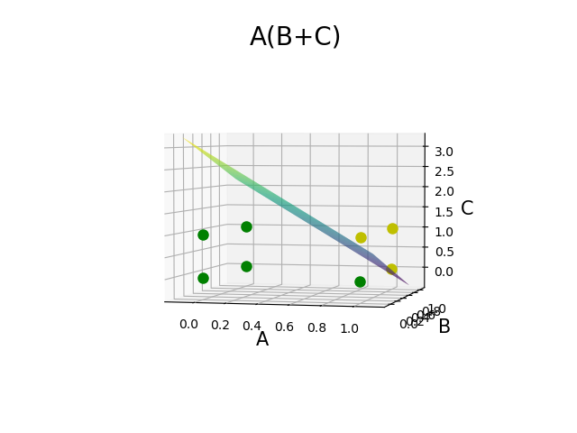

### Algoritmo del Perceptrón

```
for epoch in {1, 2, ..., epochs}
    for i in {1, 2, ..., p}
        v = w*x[i] + b
        y = phi(v)
        e = d[i] - y
        
        if e != 0
            w <- w + eta*e*x[i]
            b <- b + eta*e
```

En donde `epochs` es el número de epocas deseadas, `epoch` es la epoca actual,
`p` es el número de datos de entrada, `d` es la salida deseada y `e` la
diferencia entre la salida deseada y la obtenida, por último, `eta` es el
factor de aprendizaje del perceptrón.

### Ejercicios del Perceptrón

[Compuerta AND](https://github.com/ian16munoz3nunez1/redesNeuronales/tree/8f2e6eb6cb54249cb43ad67647a75e61515f2d84)

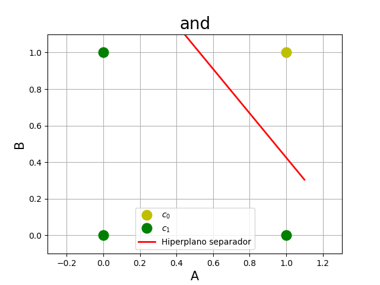

[Resolver A(B+C)](https://github.com/ian16munoz3nunez1/redesNeuronales/tree/7680adffbc0ac76376cf402cfb098e3d4e0e149b)


[Clasificación de 4 grupos](https://github.com/ian16munoz3nunez1/redesNeuronales/tree/e455500d96bbbdc9bc1fd6e7c599eb457e330739)

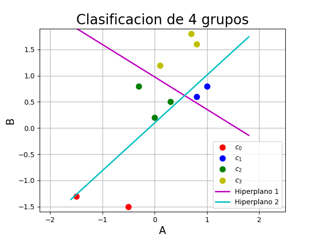

## El Adaline

El ***Adaline*** tiene la misma estructura del ***Perceptrón*** solo que en esta
neurona se utiliza la función de activación lineal o identidad, que es lo mismo
a no usar ninguna función de activación, su representación sería

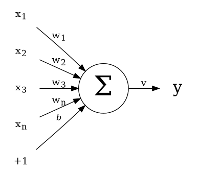

Ya que no tiene función de activación, su representación matemática es

$$
\small
y = v = \sum_{i=1}^p \left[ w_ix_i \right] + b = w_1x_1 + w_2x_2 + \cdots + w_nx_n + b
$$

o

$$
y = v = w^\top x + b
$$

### Clasificación con el ***Adaline***

Para realizar clasificación con un ***Adaline*** se usa una función signo en
lugar de una función lineal o identidad.

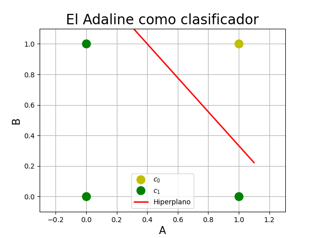

### Regresión lineal con el ***Adaline***

Para realizar regresión lineal con un ***Adaline*** se tiene la siguiente
estructura

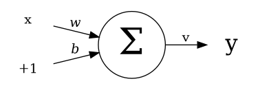

Con una representación matemática de la siguiente manera

$$
y = wx + b
$$

Con los valores

$$
\begin{matrix}
    x_1 & = & 0 \\
    y_1 & = & b
\end{matrix}
\quad\text{y}\quad
\begin{matrix}
    x_2 & = & -\dfrac{b}{w} \\
    y_2 & = & 0
\end{matrix}
$$

Con estos valores, se tienen dos puntos en el plano, con estos se puede obtener
la pendiente de una recta con la ecuación

$$
m = \dfrac{y_2-y_1}{x_2-x_1} 
$$

sustituyendo en la ecuación anterior se tiene

$$
y_2 - y_1 = m (x_2 - x_1)
$$

con esta última ecuación se puede dibujar una recta.

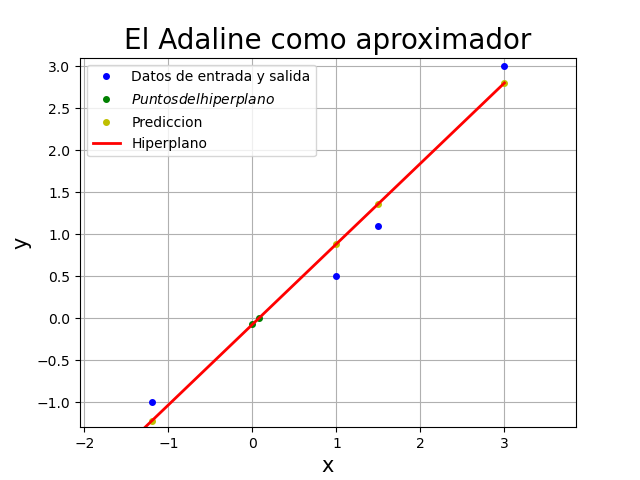

Para el entrenamiento de cualquier red, se utilizan distintas formas de
calcular el error de la red, esto es la diferencia entre la salida deseada y la
obtenida por la red

#### Error en línea

$$
E_1 = \dfrac{1}{2} (d - y)^2
$$

#### Error global o de lote completo (full-batch)

$$
E_2 = \dfrac{1}{2p} \sum_{i=1}^p \left(d^{(i)} - y^{(i)}\right)^2
$$

### Gradiente Descendente

$$
x \longleftarrow x - \eta \dfrac{d}{dx} f(x)
$$

$$
E_1 = L(d,y) = \dfrac{1}{2} \left( d - y \right)^2
$$

Usando la regla de la cadena $\frac{d}{dx} u^n = nu^{n-1} \cdot u'$ se tiene
que la derivada de la función $E_1$ es

$$
\dfrac{\partial L(d,y)}{\partial w_i} = (d-y)(-1)x_i = -(d-y) x_i
$$

y

$$
\dfrac{\partial L(d,y)}{\partial b} = -(d-y)
$$

Así, la ecuación para ajustar los pesos resulta de la siguiente manera

$$
\nabla_w L(d,y) =
\begin{bmatrix}
    \dfrac{\partial L(d,y)}{\partial w_1} \\
    \dfrac{\partial L(d,y)}{\partial w_2} \\
    \\
    \vdots \\
    \\
    \dfrac{\partial L(d,y)}{\partial w_n}
\end{bmatrix} =
\begin{bmatrix}
    -(d-y) x_1 \\
    -(d-y) x_2 \\
    \\
    \vdots
    \\
    -(d-y) x_n
\end{bmatrix} = -(d-y)
\begin{bmatrix}
    x_1 \\
    x_2 \\
    \\
    \vdots
    \\
    x_n
\end{bmatrix}
= -(d-y)x
$$

$$
\begin{matrix}
    w & \longleftarrow & w - \eta \nabla_w L(d,y) \\
    b & \longleftarrow & b - \eta \dfrac{\partial L(d,y)}{\partial b}
\end{matrix}
\quad\quad
\begin{matrix}
    w & \longleftarrow & w + \eta (d - y) x \\
    b & \longleftarrow & b + \eta (d - y)
\end{matrix}
$$

Para el gradiente descendente $E_2$ se tiene

$$
E_2 = \dfrac{1}{2p} \sum_{i=1}^p \left( d^{(i)} - y^{(i)} \right)^2
$$

$$
\nabla_w E_2 = \nabla_w \left[ \dfrac{1}{2p}  \sum_{i=1}^p \left( d^{(i)} - y^{(i)} \right)^2 \right]
$$

$$
\nabla_w E_2 = \dfrac{1}{p} \sum_{i=1}^p \left[ \nabla_w \dfrac{1}{2} \left( d^{(i)} - y^{(i)} \right)^2 \right]
$$

$$
\nabla_w E_2 = \dfrac{1}{p} \sum_{i=1}^p \left[ -\left( d^{(i)} - y^{(i)} \right) x^{(i)} \right]
$$

$$
\nabla_w E_2 = -\dfrac{1}{p} \sum_{i=1}^p \left[ \left( d^{(i)} - y^{(i)} \right) x^{(i)} \right]
$$

$$
\small
\nabla_w E_2 = -\dfrac{1}{p} \left[ (d^{(1)}-y^{(1)})x^{(1)} + (d^{(2)}-y^{(2)})x^{(2)} + \cdots + (d^{(p)}-y^{(p)})x^{(p)} \right]
$$

$$
\small
\nabla_w E_2 = -\dfrac{1}{p} \left[ (d^{(1)}-y^{(1)})
\begin{bmatrix}
    x_1^{(1)} \\
    x_2^{(1)} \\
    \vdots \\
    x_n^{(1)}
\end{bmatrix} + (d^{(2)}-y^{(2)})
\begin{bmatrix}
    x_1^{(2)} \\
    x_2^{(2)} \\
    \vdots \\
    x_n^{(2)}
\end{bmatrix} + \cdots + (d^{(p)}-y^{(p)})
\begin{bmatrix}
    x_1^{(p)} \\
    x_2^{(p)} \\
    \vdots \\
    x_n^{(p)}
\end{bmatrix}
\right]
$$

$$
\small
\nabla_w E_2 = - \dfrac{1}{p}
\begin{bmatrix}
    (d^{(1)}-y^{(1)}) & (d^{(2)}-y^{(2)}) & \cdots & (d^{(p)}-y^{(p)})
\end{bmatrix}
\begin{bmatrix}
    x_1^{(1)} & x_2^{(1)} & \cdots & x_n^{(1)} \\
    x_1^{(2)} & x_2^{(2)} & \cdots & x_n^{(2)} \\
    \vdots & \vdots & \ddots & \vdots \\
    x_1^{(p)} & x_2^{(p)} & \cdots & x_n^{(p)} \\
\end{bmatrix}
$$

$$
\small
\nabla_w E_2 = - \dfrac{1}{p} \left(
\begin{bmatrix}
    d^{(1)} & d^{(2)} & \cdots & d^{(p)}
\end{bmatrix} -
\begin{bmatrix}
    y^{(1)} & y^{(2)} & \cdots & y^{(p)}
\end{bmatrix}
\right)
\begin{bmatrix}
    x_1^{(1)} & x_2^{(1)} & \cdots & x_n^{(1)} \\
    x_1^{(2)} & x_2^{(2)} & \cdots & x_n^{(2)} \\
    \vdots & \vdots & \ddots & \vdots \\
    x_1^{(p)} & x_2^{(p)} & \cdots & x_n^{(p)} \\
\end{bmatrix}
$$

Así, se tiene que

$$
\nabla_w E_2 = - \dfrac{1}{p} (D - Y) X^\top
$$

También se tiene que

$$
\dfrac{\partial}{\partial b} E_2 = \dfrac{\partial}{\partial b} \left[
\dfrac{1}{2p} \sum_{i=1}^p \left( d^{(i)}-y^{(i)} \right)^2 \right]
$$

$$
\dfrac{\partial}{\partial b} E_2 = \dfrac{1}{p} \sum_{i=1}^p \left[
\dfrac{\partial}{\partial b} \dfrac{1}{2} \left( d^{(i)}-y^{(i)} \right)^2 \right]
$$

$$
\dfrac{\partial}{\partial b} E_2 = \dfrac{1}{p} \sum_{i=1}^p \left[
-\left( d^{(i)}-y^{(i)} \right) \right]
$$

$$
\dfrac{\partial}{\partial b} E_2 = -\dfrac{1}{p} \sum_{i=1}^p \left[
d^{(i)}-y^{(i)} \right]
$$

Por último, se tienen las ecuaciones de ajuste de pesos y bias de la siguiente
manera

$$
Y = wX + b
$$

$$
w \longleftarrow w + \dfrac{\eta}{p} (D - Y) X^\top
$$

$$
b \longleftarrow b + \dfrac{\eta}{p} (D - Y)
$$

$$
b \longleftarrow b + \dfrac{\eta}{p} \sum_{i=1}^p \left( d^{(i)} - y^{(i)} \right)
$$

### Métodos SGD y BGD

Comúnmente, en las redes neuronales se utilizan métodos para usar de mejor
manera los recursos computacionales dependiendo de la situación y lo que se
necesita.

Estos métodos son el ***SGD (Single Gradient Descent)*** y
***BGD (Batch Gradient Descent)***. El primero toma uno por uno los datos de
entrada, este se ajusta en muy pocas epocas, pero consume muchos recursos
computacionales, mientras que el ***BGD*** toma todos los datos de entrada, este
demora más épocas en terminar el entrenamiento pero consume menos recursos
computacionales.

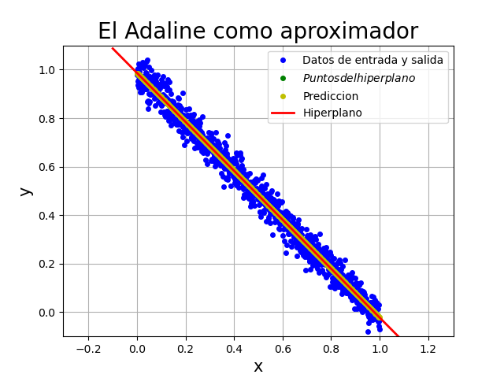

### La Neurona Logística

En la neurona logística se usa una función logística como función de activación

$$
\log \left( \dfrac{p}{1-p} \right) = w_1x_1 + w_2x_2 + \cdots + w_nx_n + b = v
$$

$$
\log \left( \dfrac{p}{1-p} \right) = v
\quad\quad
\dfrac{p}{1-p} = e^v
\quad\quad
p = e^v (1 - p)
$$

$$
p = e^v - pe^v
\quad\quad
p + pe^v = e^v
\quad\quad
p (1 + e^v) = e^v
$$

$$
p = \dfrac{e^v}{1 + e^v}
\quad\quad
p = \dfrac{e^v}{1 + e^v} \left( \dfrac{\frac{1}{e^v}}{\frac{1}{e^v}} \right)
\quad\quad
p = \dfrac{1}{1 + e^{-v}}
$$

La estructura de la neurona logística queda de la siguiente manera

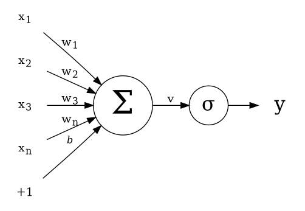

Con

$$
v = w^\top x + b
\quad\text{y}\quad
y = \sigma (v) = \dfrac{1}{1 + e^{-v}}
$$

#### Gradiente descendente de la neurona logística

$$
E_1 = \dfrac{1}{2} (d - y)^2
\quad\quad
v = w^\top x + b
\quad\quad
y = \sigma (v) = \dfrac{1}{1 + e^{-v}}
$$

$$
\dfrac{\partial}{\partial w_i} E_1 = -(d - y)
$$

Usando la regla $\frac{d}{dx} \left( \frac{u}{v} \right) = \frac{u'v - uv'}{v^2}$ se tiene

$$
\dfrac{d}{dv}y = \dfrac{(0)(1+e^{-v}) - (1)(-e^{-v})}{(1+e^{-v})^2}
\quad\quad
\dfrac{d}{dv}y = \dfrac{e^{-v}}{(1 + e^{-v})^2}
$$

$$
\dfrac{d}{dv}y = \left( \dfrac{1}{1 + e^{-v}} \right) \left( \dfrac{e^{-v}}{1 + e^{-v}} \right)
\quad\quad
\dfrac{d}{dv}y = \left( \dfrac{1}{1 + e^{-v}} \right) \left( \dfrac{1 + e^{-v} - 1}{1 + e^{-v}} \right)
$$

$$
\dfrac{d}{dv}y = \left( \dfrac{1}{1+e^{-v}} \right) \left( \cancel{\dfrac{1+e^{-v}}{1+e^{-v}}} - \dfrac{1}{1+e^{-v}} \right)
\quad\quad
\dfrac{d}{dv}y = \left( \dfrac{1}{1+e^{-v}} \right) \left( 1 - \dfrac{1}{1+e^{-v}} \right)
$$

$$
\dfrac{d}{dv}y = y (1 - y)
$$

$$
\dfrac{\partial}{\partial w_i}E_1 = -(d-y) \left[ y(1-y) \right] x_i
$$

$$
\dfrac{\partial}{\partial b} E_1 = -(d-y) \left[ y(1-y) \right]
$$

Así, el gradiente descendente es

$$
\begin{matrix}
    w & \longleftarrow & w + \eta (d-y) \big[ y(1-y) \big] x \\
    b & \longleftarrow & b + \eta (d-y) \big[ y(1-y) \big]
\end{matrix}
$$

## Anexo

### Perceptrón

$$
v = \sum_{i=1}^p \left[ w_ix_i \right] + b
$$

$$
v = w^\top x + b
$$

$$
y = \varphi (v)
$$

$$
e = d_i - y
$$

$$
w \leftarrow w + \eta e x_i
$$

$$
b \leftarrow b + \eta e
$$

$$
x_2 = -\dfrac{w_1}{w_2}x_1 - \dfrac{b}{w_2} 
$$

$$
x_3 = -\dfrac{w_1x_1}{w_3} - \dfrac{w_2x_2}{w_3} - \dfrac{b}{w_3}
$$

### Adaline

Con

$$
y = wx + b
$$

$$
\begin{matrix}
    x_1 & = & 0 \\
    y_1 & = & b
\end{matrix}
\quad\text{y}\quad
\begin{matrix}
    x_2 & = & -\dfrac{b}{w} \\
    y_2 & = & 0
\end{matrix}
$$

Con los valores anteriores se tienen las ecuaciones

$$
m = \dfrac{y_2-y_1}{x_2-x_1}
\quad\quad\quad
y_2 - y_1 = m (x_2 - x_1)
$$

Con

$$
E_1 = \dfrac{1}{2} (d-y)^2
$$

Se tiene un gradiente descendente

$$
w \longleftarrow w + \eta (d - y) x
$$

$$
b \longleftarrow b + \eta (d - y)
$$

Y con

$$
E_2 = \dfrac{1}{2p} \sum_{i=1}^p \left( d^{(i)} - y^{(i)} \right)^2
$$

se tiene el gradiente descendente

$$
w \longleftarrow w + \dfrac{\eta}{p} (D - Y) X^\top
$$

$$
b \longleftarrow b + \dfrac{\eta}{p} \sum_{i=1}^p \left( d^{(i)} - y^{(i)} \right)
$$

